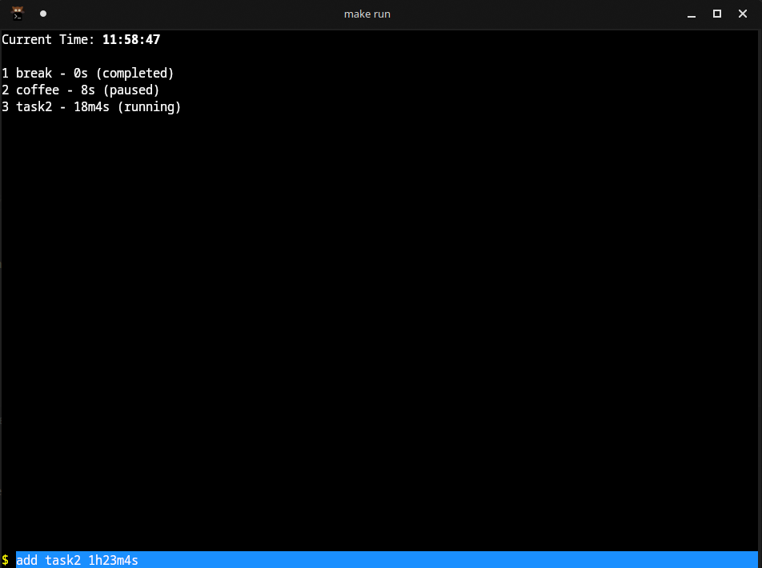

# Timer CLI

A simple and efficient CLI-based timer application for managing tasks.



[](https://youtu.be/AkPSsD15mF8)

## Features

- Add, start, pause, and resume tasks.
- Real-time task display.
- Modify task name and duration.
- Configuration management.

## Installation

Ensure you have `make` installed on your system before building the project.

### Build and Run

```bash
make build
./bin/timer-cli
```

To run directly:

```bash
make run
```

## Usage

Below are the available commands for interacting with the Timer CLI:

```text
1. add <task_name> <duration>     # Add a new task with a duration (e.g., "add Coding 30m")
2. start <task_id>                # Start the specified task
3. pause <task_id>                # Pause an active task
4. modify <task_id> -n <new_name>  # Rename an existing task
5. modify <task_id> -d <new_duration>  # Change task duration
6. quit                           # Exit the Timer CLI
```

### Example Usage

```bash
$ add Writing 45m
$ start 1
$ pause 1
$ modify 1 -n Blogging
$ modify 1 -d 60m

```

## Configuration

The Timer CLI supports basic configuration management. You can customize settings in a config file (if applicable) to suit your needs.


[demonstration video](https://youtu.be/AkPSsD15mF8)